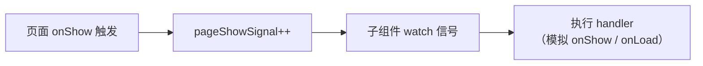
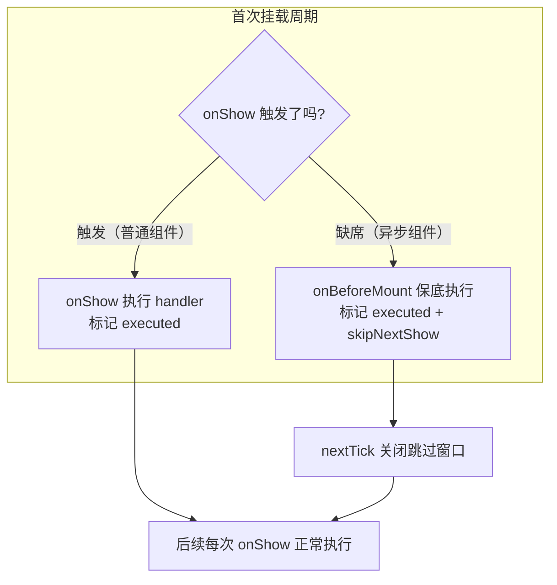
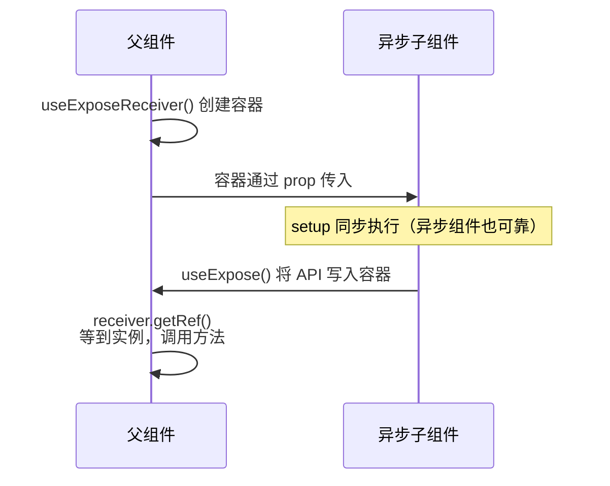
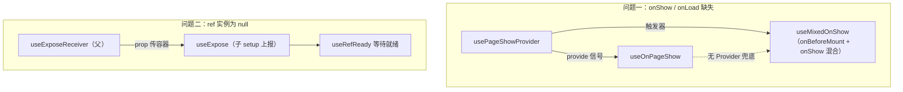

> 记录一次从现象排查到工具沉淀的完整过程：uniapp 小程序端异步子组件的 `onShow` / `onLoad` 首次访问不触发、父组件模板 ref 拿不到实例，以及由此沉淀出的 `useMixedOnShow`、`PageShowSignal`、`useExpose` 三套工具。

## 问题背景

在小程序分包 + 异步组件（`componentPlaceholder`）的场景下，首次进入页面时会遇到两个问题：

1. **异步子组件的 `onShow`、`onLoad` 不触发** —— 切换页面再回来后 `onShow` 恢复正常，但 `onLoad` 本身只有一次执行机会，等于被"吞掉"了；
2. **父组件通过模板 ref 获取异步子组件实例为 `null`** —— 且不是"晚一点才赋值"：在当前页面内即使延迟 10s 也取不到，必须切页面再回来才正常。

> [!NOTE]
> 一个关键观察：`onShow` 的恢复**不需要切换页面路由**。
当前页面渲染完毕后，回到桌面（Home）再切回应用，`onShow` 就能正常触发了。
这说明**异步组件加载完成之后，生命周期注册本身是生效的**——问题只出在"首次挂载"这个窗口期。
`onLoad` 理论上也一样，只是它唯一的执行机会恰好落在这个窗口里，被吞掉后再无机会。

### 实测：异步组件环境下各生命周期的表现

结合 [uniapp 页面生命周期流程](https://uniapp.dcloud.net.cn/tutorial/page.html#vue3-lifecycle-flow)，在异步子组件内逐个实测：

| 生命周期 | 首次挂载 | 后续（切页面/切前后台回来） |
| --- | :---: | :---: |
| setup 直接执行 | ✅ | - |
| `onLoad` | ❌ | -（仅一次机会，已被吞） |
| `onShow` | ❌ | ✅ |
| `onBeforeMount` | ✅ | - |
| `onMounted` | ✅ | - |
| `onReady` | ✅ | - |

**除了 `onLoad` 和 `onShow`，其余生命周期在异步组件环境下都是生效的。** 这张表是后续所有方案的基石。

另一个平台差异：H5 端 `setup` 直接执行、`onLoad`、`onShow` 三者近似"平级"，触发顺序跟书写次序有关；
而小程序端有确定的先后。
这也提示我们：与其依赖具体平台的触发顺序，不如设计不依赖顺序的机制。

## 问题一：onShow / onLoad 缺失

### 第一阶段：PageShowSignal —— 由父组件的 onShow 带动

最初的场景里，**父组件（页面）都处于非异步环境**，它的 `onShow` 是正常触发的。由此产生一个朴素的物理直觉：

> 父组件 onShow 了，子组件自然就应该 onShow —— 这个因果关系是成立的，那就让父组件的 onShow 去"带动"子组件本该触发的 handler。

于是设计了 **PageShowSignal** 机制：父组件在 `onShow` 中递增一个信号计数，子组件响应式地消费这个信号。



消费端 `usePageShowSignalEffect` 有几个设计细节：

- 信号是**计数**而非布尔值，天然携带"第几次显示"的信息，且每次递增必然触发 watch；
- handler 支持异步，内部用 `flushing` + `handledSignal` 做**串行消费**：handler 执行期间信号再次变化，会在 while 循环中补消费，不丢事件也不并发重入；
- `once: true` 表示 handler **实际完成一次后**才停止 —— 这也是为什么不能用 Vue watch 自带的 `once` 选项（它在触发时即停，不等异步 handler 完成），需要手动 `stop()`。

### 第二阶段：provide / inject 封装

信号通过 props 逐层传递太笨重，于是用 Vue 的 provide/inject 封装成一对开箱即用的 API：

- **`usePageShowProvider`**：页面级调用一次，创建信号源并向所有后代广播；
- **`useOnPageShow`**：任意后代（含异步子组件）调用，替代 `onShow`（`once: true` 时替代 `onLoad`）。

```vue
<!-- 页面 -->
<script setup lang="ts">
usePageShowProvider()
</script>

<!-- 任意异步子组件 -->
<script setup lang="ts">
useOnPageShow(() => { /* 每次页面显示 */ })
useOnPageShow(async () => { /* 仅首次，替代 onLoad */ }, { once: true })
</script>
```

#### 多实例与嵌套实例问题

Provider 允许被多处调用后，必须回答"嵌套了怎么办"：

- **就近原则的陷阱**：若子组件也调用 Provider 并 provide 新信号，后代会拿到"最近"的信号。但如果这个中间组件本身是异步组件，它的 `onShow` 不触发，新信号就是一潭死水——整条链在它这里断掉；
- **最终选择：检测复用**。`usePageShowProvider` 先 `inject`，发现祖先已有信号则直接返回复用，不再创建新层。整个页面共享唯一信号源，链路上有没有异步组件都不影响。

> [!IMPORTANT]
> 曾评估过"信号中继"方案（嵌套时 watch 父级信号并转发），能保留"父对子、子对孙"的分层语义。
但回到需求本身——只是要让异步子组件收到页面显示事件——一个页面一个信号源已经足够，中继属于过度设计，最终放弃。

#### 无 Provider 时的兜底

`useOnPageShow` 从一开始就保留了**无 Provider 时降级到原生生命周期**的机制，保证它可以单独使用。
早期的兜底策略是对照 uniapp 生命周期图：`once` 时用 `onBeforeMount` 模拟 `onLoad`（时序相近、只执行一次、且异步环境可靠），非 `once` 时用组件内的 `onShow`。

但这带来一个隐患：**兜底路径和信号路径的行为不一致**。
信号路径下 `once` 的触发时机是"页面显示时"，兜底路径下却是"挂载前"；且兜底的 once / 非 once 用了两个不同的生命周期。
这个不一致成了下一步演化的直接动因。

### 第三阶段：useMixedOnShow —— 混合出一个兼容异步组件的 onShow

把前面的实测结论组合起来：

- `onBeforeMount` 在异步组件首次挂载时**可靠触发**（但只有一次）；
- `onShow` 首次缺席，但**异步组件加载完成后即恢复**（后续每次都触发）。

两者恰好互补——**用 `onBeforeMount` 补首次，用 `onShow` 管后续**，就能混合出一个在异步组件环境下完整可用的 onShow：



实现上的几个关键取舍：

1. **不依赖触发顺序**。虽然生命周期图上 `onShow` 早于 `beforeMount`，但程序应当稳健：用单一 `executed` 标记 + 卫语句（`if (executed) return`）让两个 hook 互斥，谁先到谁执行，另一个自动跳过；
2. **防"首次双触发"**。若 `onBeforeMount` 先执行了首次，同一挂载周期内姗姗来迟的 `onShow` 需要跳过（`skipNextShow`），否则首次会执行两次；
3. **跳过窗口用 `nextTick` 关闭，而不是 `onMounted`**。生命周期 hook 在同一次渲染 flush 内同步执行，`nextTick` 回调在 flush 结束后运行，保护窗口是 `onMounted` 方案的超集；且它是调度原语而非第三个生命周期依赖，开启与关闭窗口的逻辑内聚在同一处，不存在"异步组件下它会不会触发"的疑虑；
4. **窗口关闭后**，异步组件场景下用户切后台再回来的那次**真实** `onShow` 不会被误跳过——这是单纯 skip 标记方案会丢事件的反例，也是必须有"窗口"概念的原因。

### 无心插柳：useMixedOnShow 单独就是答案

`useMixedOnShow` 的原始动机只是**替换两处内部实现**：

- `usePageShowProvider` 内部的信号触发器（原来直接用 `onShow`，要求 Provider 必须在非异步环境调用，还得配警告；换成 `useMixedOnShow` 后这个限制自然消失）；
- `useOnPageShow` 的兜底逻辑（once / 非 once 统一走 `useMixedOnShow`，与信号路径行为对齐）。

但替换完成后回头一看——**`useMixedOnShow` 自己就把问题一完整解决了**：

```ts
// 任意异步子组件内，无需任何 Provider：
useMixedOnShow(() => { /* 替代 onShow */ })
useMixedOnShow(() => { /* 替代 onLoad */ }, { once: true })
```

> [!TIP]
> 两套方案的出发点和原理并不相同：**PageShowSignal 是"外部驱动"**——借父组件正常的 onShow 从组件树上方推送事件；
**useMixedOnShow 是"内部自愈"**——在组件自身内部用可靠的生命周期拼补出缺失的那个。
前者演化在先、后者破土在后，最终两者协作：Provider 用 mixed 版 onShow 做触发器，信号负责广播；无 Provider 时 mixed 版直接兜底。
属于无心插柳，但柳成荫的前提是先把前面的每一步都走过了。

## 问题二：父组件拿不到异步子组件的 ref 实例

### 被动等待是死路

第一反应是写一个 `useRefReady`：`watchEffect` 监听模板 ref，等它变为非空后 resolve。

但实测证伪了这条路：**小程序端首次挂载时，框架根本不给模板 ref 赋值**——不是异步晚到，是这个渲染周期内压根不发生。
监听一个永远不会变化的 ref，等多久都没用。

> [!WARNING]
> 结论：被动等待（拉取）解决不了这个问题，必须反转方向——**子组件主动上报（推送）**。

### useExpose：子组件在 setup 里自发上报

依据还是那张实测表：**异步子组件的 `setup` 是正常同步执行的**。
那么让父组件先创建一个容器，通过 prop 交给子组件，子组件在 setup 里把自己的 API 写进去：



```vue
<!-- 子组件 -->
<script setup lang="ts">
const props = defineProps<{ expose?: ExposeReceiver<any> }>()

const exposed = { test }
useExpose(props.expose, exposed) // 主动上报
defineExpose(exposed) // 保留，H5 模板 ref 依然可用
</script>

<!-- 父组件 -->
<script setup lang="ts">
const receiver = useExposeReceiver<ComponentExposed<typeof Demo>>()

onShow(async () => {
  const demo = await receiver.getRef()
  demo.test('from parent')
})
</script>

<template>
  <Demo :expose="receiver" />
</template>
```

设计过程中踩过 / 权衡过的点：

1. **多实例 / 重名问题**。曾用字符串 name + 全局注册表实现（provide/inject 反向注册），但只要存在共享命名空间就永远有碰撞可能（v-for、同组件用两次、恰好同名）。最终改为**每实例一个专属容器对象**——容器本身就是身份，碰撞在结构上不可能发生；
2. **模板 ref 自动解包的坑**。setup 顶层的 ref 在模板表达式中会被自动解包，`:expose="demoRef"` 传下去的是解包后的当前值（`null`）而不是 ref 本身，整条链路静默失效。因此容器包了一层普通对象 `{ ref: shallowRef }`，且约定**传递整个容器对象**——普通对象永远不会被解包，连解构误用都防住了；
3. **类型不需要子组件显式导出**。`ComponentExposed<typeof Demo>`（实现取自 vue-component-type-helpers）直接从组件类型中提取 `defineExpose` 的类型；子组件用**同一个 `exposed` 对象**传入 `useExpose` 和 `defineExpose`，`useExpose` 同样只解包对象的顶层 ref，因此运行时与类型保持一致。缓存 receiver 返回的实例后，顶层 ref 仍会读取最新 `.value`；深层行为继续由原始的 `ref`、`shallowRef` 或 `reactive` 决定；
4. **卸载清理**。`onUnmounted` 时仅当容器还指向自己才清空，多实例下 A 卸载不会误清 B 刚写入的值；
5. **等待任务归属父作用域**。`useExposeReceiver` 需要在父组件 setup 的活动作用域中创建；`getRef()` 可以在生命周期或事件回调中调用，内部等待仍归父组件作用域管理，父组件卸载时会停止并 reject。

而 `useRefReady` 并没有废弃——它成为 `getRef()` 内部的等待原语：容器由子组件 setup 主动赋值，`watchEffect` 能正常等到；父组件 setup 先于子组件执行，handler 触发时子组件可能还没 setup 完，`useRefReady` 正好兜住这个时间差。

> [!TIP]
> 这个"setup 上报"的思路还有额外收益：它顺带回答了**"异步组件到底什么时候渲染出来了"**——setup 是开发者能接触到的最早执行时机，即使不确定它在整个组件生命周期中的精确位置，"容器被写入"这个事件本身就是异步组件已到达的可靠信号。

## 最终工具全景

| 工具 | 角色 | 解决什么 |
| --- | --- | --- |
| `useMixedOnShow` | 独立 Hook | 异步组件内直接替代 onShow / onLoad（内部自愈） |
| `usePageShowSignal` / `usePageShowSignalEffect` | 底层原语 | 信号的生产与串行消费 |
| `usePageShowProvider` / `useOnPageShow` | 页面级方案 | 信号广播，后代零负担消费（外部驱动），无 Provider 自动降级到 mixed |
| `useExposeReceiver` / `useExpose` | 父子契约 | 子组件主动上报实例，替代失效的模板 ref |
| `useRefReady` | 通用原语 | 等待任意 ref 就绪（快速路径 + 作用域托管的 watchEffect） |
| `ComponentExposed<T>` | 类型工具 | 从组件类型提取 defineExpose 类型 |



## 回顾

几条贯穿全程的经验：

- **先做生命周期的完整实测**，哪张表哪个 ✅/❌ 都可能成为方案的支点（`onBeforeMount` 可靠 + `onShow` 可恢复 ⇒ 混合方案；setup 可靠 ⇒ 上报方案）；
- **不依赖平台的触发顺序**，用标记 + 卫语句让机制对顺序免疫，H5 与小程序的时序差异就不再是问题；
- **拉不到就让对方推**——当框架层面不给数据（模板 ref 不赋值），反转数据流向往往是唯一出路；
- **警惕共享命名空间**，结构上消灭碰撞好过约定上避免碰撞；
- 方案不是一蹴而就的：PageShowSignal → provide/inject → 嵌套治理 → 行为一致性 → useMixedOnShow，每一步都由上一步暴露的问题驱动，最后那个"最简单的答案"恰恰长在最长的那条演化路径尽头。

## 参考

- [uniapp 页面生命周期（Vue3 流程图）](https://uniapp.dcloud.net.cn/tutorial/page.html#vue3-lifecycle-flow)
- [componentPlaceholder（异步组件占位）](https://github.com/uni-ku/bundle-optimizer)
- [vue-component-type-helpers](https://github.com/vuejs/language-tools/tree/master/packages/component-type-helpers)

相关源码：

- [`src/composables/usePageShowSignal.ts`](https://github.com/Vanisper/uniapp-template/blob/main/src/composables/usePageShowSignal.ts)
- [`src/composables/useExpose.ts`](https://github.com/Vanisper/uniapp-template/blob/main/src/composables/useExpose.ts)
- [`src/composables/useRefReady.ts`](https://github.com/Vanisper/uniapp-template/blob/main/src/composables/useRefReady.ts)
